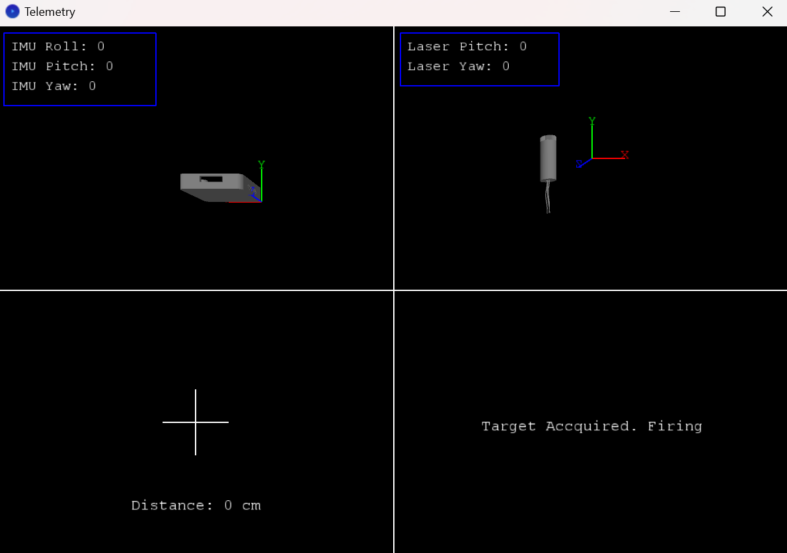

# ENME-351-Project

This was a project for my ENME351 class at the University of Maryland. I created an IMU-guided 2-Axis gimbal that had an IR distance sensor and laser diode mounted to it for target sensing. The software for this project was written in Arduino C++ and Processing.

---

## Hardware List
The following components were used in this project:
- **Arduino Uno**
- **BNO055 9-DOF Absolute Orientation IMU Sensor**
- **GP2Y0A21YK0F SHARP IR Distance Sensor**
- **HiLetgo 5V 650nm 5mW Laser Diode**
- **FEETECH Mini Servo FT1117M (x2)**
- **6.0 V, 2200 mAh Rechargeable NiMH Battery (x2)**
- **Breadboard**
- **M3 screws**

---

## How It Works

---

## Telemetry Window
Here’s a picture of the graphical display window

---

## Embedded Video
Watch the project demonstration video here:

---
